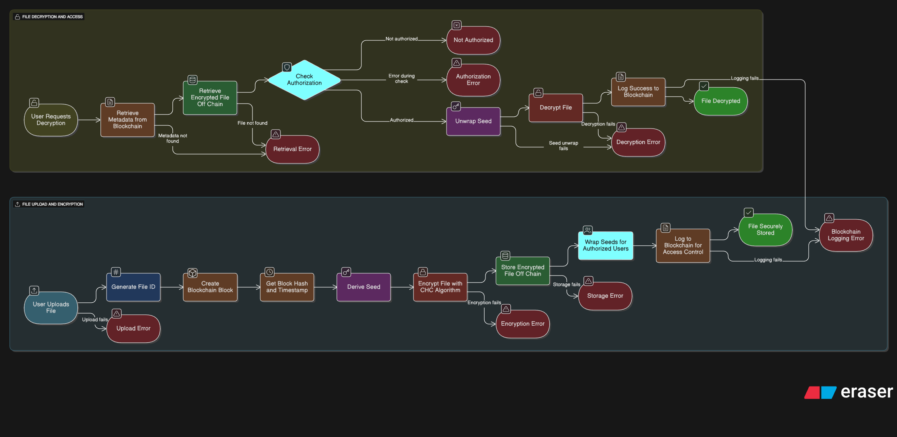

# CHC Secure File Management System

A secure file management system that implements **blockchain-linked contextual encryption** for maximum security and controlled access. This system demonstrates advanced cryptographic techniques including Contextual Hash Chain (CHC) encryption, blockchain integration, and per-user access control.

> **Frontend**: The system uses a modern React + TypeScript + Vite frontend (`CHCAPP/`) with a Flask backend API server.

---

## 📊 System Flow Diagram

The system implements two main processes: **File Upload and Encryption** and **File Decryption and Access**. The complete flow is illustrated in the diagram below:



---

## 🏗️ System Architecture & Process Flow

### Process 1: File Upload and Encryption

This process handles secure file upload, encryption, and storage with blockchain integration:

#### Step 1: User Uploads File
- User selects a file through the web interface
- File is validated (size, format, etc.)
- **Error Handling**: If upload fails → Upload Error

#### Step 2: Generate File ID
- System generates a unique file identifier
- File ID is based on filename, owner, and timestamp

#### Step 3: Create Blockchain Block
- A new block is created in the blockchain
- Block contains file metadata (filename, size, owner, authorized users)

#### Step 4: Get Block Hash and Timestamp
- System retrieves the cryptographic hash of the block
- Timestamp is recorded for temporal context
- These values provide **contextual uniqueness** for encryption

#### Step 5: Derive Seed
- Encryption seed is derived using:
  - Owner's master secret
  - Block hash (from blockchain)
  - Timestamp
  - File ID
- This ensures **unique encryption** for each file

#### Step 6: Encrypt File with CHC Algorithm
- File is encrypted using Contextual Hash Chain (CHC) algorithm
- CHC provides **forward security** through state chaining
- Each block's encryption depends on previous ciphertext
- **Error Handling**: If encryption fails → Encryption Error

#### Step 7: Store Encrypted File Off Chain
- Encrypted file is stored in secure off-chain storage (Firestore)
- Only encrypted data is stored, never plaintext
- **Error Handling**: If storage fails → Storage Error

#### Step 8: Wrap Seeds for Authorized Users
- Encryption seed is wrapped (encrypted) for each authorized user
- Each user gets their own wrapped seed using their user key
- Owner also gets a wrapped seed for access

#### Step 9: Log to Blockchain for Access Control
- Access control information is logged to blockchain
- Includes: owner, authorized users, file ID, block hash
- Creates immutable audit trail
- **Error Handling**: If logging fails → Blockchain Logging Error

#### Step 10: File Securely Stored
- Process completes successfully
- File is encrypted, stored, and access control is enforced

---

### Process 2: File Decryption and Access

This process handles secure file retrieval, authorization, and decryption:

#### Step 1: User Requests Decryption
- User requests to decrypt and download a file
- User provides file ID and their username

#### Step 2: Retrieve Metadata from Blockchain
- System retrieves file metadata from blockchain
- Includes: file ID, owner, authorized users, block hash, timestamp
- **Error Handling**: If metadata not found → Retrieval Error

#### Step 3: Retrieve Encrypted File Off Chain
- System retrieves the encrypted file from off-chain storage
- File is fetched from secure storage (Firestore)
- **Error Handling**: If file not found → Retrieval Error

#### Step 4: Check Authorization
- System verifies if the requesting user is authorized
- Checks if user is the owner or in the authorized users list
- **Error Handling**: 
  - If not authorized → Not Authorized (access denied)
  - If error during check → Authorization Error

#### Step 5: Unwrap Seed
- If authorized, system retrieves the user's wrapped seed
- Seed is unwrapped (decrypted) using the user's key
- **Error Handling**: If seed unwrap fails → Decryption Error

#### Step 6: Decrypt File
- File is decrypted using CHC algorithm and the unwrapped seed
- CHC decryption reverses the encryption process
- Plaintext is reconstructed from ciphertext
- **Error Handling**: If decryption fails → Decryption Error

#### Step 7: Log Success to Blockchain
- Successful decryption is logged to blockchain
- Creates audit trail of authorized access
- **Error Handling**: If logging fails → Blockchain Logging Error

#### Step 8: File Decrypted
- Process completes successfully
- Decrypted file is returned to the user
- User can download and access the file

---

## 🔐 Security Features

### Cryptographic Security
- **Contextual Encryption**: Each file encrypted with unique blockchain-derived seed
- **Forward Security**: CHC algorithm prevents retrospective decryption
- **HMAC-SHA256**: Cryptographically secure hash functions
- **256-bit Seeds**: Strong encryption keys

### Access Control
- **Per-User Authorization**: Only authorized users can decrypt files
- **Cryptographic Enforcement**: Access control enforced through key wrapping
- **Audit Trail**: All access attempts logged to blockchain
- **Unauthorized Access Prevention**: Unauthorized users are blocked

### Blockchain Integration
- **Immutable Records**: Blockchain provides tamper-proof audit trail
- **Hash Chain**: SHA-256 hash chain ensures integrity
- **Context Generation**: Block hash and timestamp provide unique context
- **Access Control Logging**: All operations logged to blockchain

### Storage Security
- **Off-Chain Storage**: Encrypted files stored securely off-chain
- **Key Vault**: Wrapped seeds stored separately from encrypted files
- **Metadata Separation**: Metadata and encrypted data stored separately
- **Backup System**: Automated backup and recovery

---

## 🌟 Key Features

### Advanced Security
- ✅ **Contextual Encryption**: Blockchain-derived unique seeds
- ✅ **Forward Security**: CHC algorithm with state chaining
- ✅ **Access Control**: Cryptographically enforced permissions
- ✅ **Tamper-Proof Records**: Immutable blockchain audit trail
- ✅ **User Authentication**: Secure session management
- ✅ **Rate Limiting**: API protection against abuse

### User Management
- ✅ **User Registration**: Secure user registration
- ✅ **User Login**: PBKDF2-SHA256 password hashing
- ✅ **Session Management**: Secure session tokens
- ✅ **Role-Based Access**: User and admin roles
- ✅ **Profile Management**: User profile management

### File Management
- ✅ **File Upload**: Secure file upload with encryption
- ✅ **File Listing**: View all uploaded files
- ✅ **File Decryption**: Authorized file decryption
- ✅ **File Metadata**: View file metadata and audit trail
- ✅ **Security Audit**: Complete security audit trail

### Blockchain Features
- ✅ **Blockchain Viewer**: View blockchain records
- ✅ **Security Audit**: Complete audit trail visualization
- ✅ **Integrity Verification**: Cryptographic chain validation
- ✅ **Access Logging**: All operations logged to blockchain

---

## 🚀 Quick Start

### Prerequisites
- Python 3.8+
- Node.js 16+ (for frontend)
- Firebase account (for cloud storage)
- Required Python packages (see `requirements.txt`)

### Installation

1. **Clone the repository**
   ```bash
   git clone <repository-url>
   cd Project
   ```

2. **Install backend dependencies**
   ```bash
   pip install -r requirements.txt
   ```

3. **Set up environment variables**
   - Create a `.env` file in the root directory
   - Add your Firebase credentials and configuration
   - See `CREATE_ENV_FILE.md` for details

4. **Run the backend (Flask API)**
   ```bash
   python app.py
   ```
   Backend will run on `http://127.0.0.1:5000`

5. **Run the frontend (CHCAPP)**
   ```bash
   cd CHCAPP
   npm install   # or: yarn install
   npm run dev   # or: yarn dev
   ```
   Frontend will run on `http://127.0.0.1:5173`

6. **Access the application**
   - Open your browser and navigate to `http://127.0.0.1:5173`
   - Register a new user or login with existing credentials
   - Start uploading and managing files

---

## 📋 How to Use

### 1. Upload a File

1. Navigate to the **Upload** page
2. Select a file from your device
3. Enter **Owner Name** (your username)
4. Specify **Authorized Users** (comma-separated list of usernames)
5. Click **Upload**

**What happens:**
- File is encrypted using CHC algorithm
- Unique seed is derived from blockchain context
- Encrypted file is stored off-chain
- Access control is logged to blockchain
- Wrapped seeds are created for authorized users

### 2. View Your Files

1. Navigate to the **Files** page
2. See all uploaded files with metadata
3. View file details: owner, authorized users, block hash, timestamp
4. Click **Security** to view audit trail
5. Click **Decrypt** to access files

### 3. Decrypt a File

1. Click **Decrypt** on any file
2. Enter your **User Name** (must be authorized)
3. Click **Decrypt File**

**Access Control:**
- ✅ **Authorized users**: File decrypts successfully
- ❌ **Unauthorized users**: Access denied with audit logging

### 4. Security Audit

1. Click **Security** button on any file
2. View complete audit trail
3. See security verification results
4. Monitor access attempts and outcomes

---

## 🔧 Technical Implementation

### CHC Encryption Algorithm

The Contextual Hash Chain (CHC) algorithm provides forward security:

```python
# Seed Generation
seed = HMAC-SHA256(owner_secret, block_hash + timestamp + file_id)

# CHC Encryption (per block)
for each block i:
    keystream = HMAC(state, block_index)
    ciphertext = plaintext XOR keystream
    state = HMAC(state, ciphertext)
```

**Key Properties:**
- **Forward Security**: Each block's encryption depends on previous ciphertext
- **State Chaining**: State is updated with each encrypted block
- **Contextual Uniqueness**: Seed derived from blockchain context
- **Cryptographic Security**: HMAC-SHA256 for all operations

### Blockchain Integration

- **Immutable Records**: SHA-256 hash chain
- **Context Generation**: Block hash + timestamp for unique seeds
- **Audit Trail**: Complete access control logging
- **Integrity Verification**: Cryptographic chain validation

### Key Management

- **Master Keys**: System and user master keys with Fernet encryption
- **Wrapped Seeds**: Per-user encrypted seeds for access control
- **Secure Storage**: Double-encrypted key vault
- **Key Derivation**: HMAC-based key generation

---

## 📁 Project Structure

```
Project/
├── app.py                 # Main Flask application (API server)
├── blockchain.py          # Blockchain implementation
├── encryption.py          # CHC encryption module
├── auth.py               # User authentication
├── data_manager.py       # Secure data storage (Firestore)
├── requirements.txt      # Python dependencies
├── .env                  # Environment variables (create this)
├── CHCAPP/               # React + TypeScript frontend
│   ├── src/
│   │   ├── pages/       # React pages (Upload, Files, etc.)
│   │   ├── components/  # React components
│   │   └── utils/       # API utilities
│   ├── public/
│   │   └── flowchart.png  # System flow diagram
│   └── package.json     # Node.js dependencies
├── static/
│   └── flowchart.png    # System flow diagram
├── secure_storage/      # Local storage (if not using Firestore)
│   ├── encrypted_files/ # Encrypted files
│   ├── key_vault/      # Wrapped seeds
│   ├── metadata/       # File metadata
│   └── backups/        # System backups
└── uploads/            # Temporary file storage
```

---

## 📊 API Endpoints

### Authentication Endpoints
- `POST /api/register` - User registration
- `POST /api/login` - User login
- `POST /api/logout` - User logout
- `GET /api/auth/check` - Check authentication status

### File Management Endpoints
- `POST /api/upload` - Upload and encrypt file
- `GET /api/files` - List all files
- `POST /api/decrypt/<file_id>` - Decrypt and download file
- `GET /api/security/<file_id>` - Get security audit trail

### Blockchain Endpoints
- `GET /api/blockchain` - Get blockchain data
- `GET /api/ping` - Health check

---

## 🔍 Security Features

### Data Protection
- **Contextual Encryption**: Each file gets unique seed from blockchain
- **Forward Security**: CHC provides state chaining
- **Access Control**: Only authorized users can decrypt
- **Integrity Verification**: File integrity checked on access

### Audit & Monitoring
- **Complete Audit Trail**: Every action logged to blockchain
- **Security Verification**: Cryptographic verification of operations
- **Access Monitoring**: Track all access attempts
- **Tamper-Proof Records**: Immutable blockchain records

### User Management
- **Owner Control**: File owners specify authorized users
- **User Authentication**: Secure session management
- **Role-Based Access**: User and admin roles
- **Session Security**: Secure session tokens

---

## 🧪 Testing

The project includes comprehensive testing:

```bash
# Run test suite
python test/test_chc.py

# Run demo scenarios
python test/demo_secure_flow.py
```

**Test Results:**
- ✅ 14 tests passing (100% success rate)
- ✅ Cryptographic primitives verified
- ✅ CHC encryption/decryption correctness
- ✅ Access control enforcement
- ✅ Security properties validated

---

## 🚨 Troubleshooting

### Common Issues

**File Upload Fails**
- Check file size (max 16MB)
- Ensure valid file format
- Verify owner name provided
- Check Firebase credentials

**Decryption Fails**
- Verify you're an authorized user
- Check if file exists in system
- Ensure correct user name
- Verify wrapped seed exists

**Security Audit Empty**
- File may not have been accessed yet
- Check blockchain integrity
- Verify file metadata
- Check access logs

**Authentication Issues**
- Verify session token is valid
- Check if user exists
- Ensure correct password
- Check session expiration

---

## 📈 Performance Metrics

- **Encryption Speed**: ~0.0002 seconds for small files
- **Decryption Speed**: ~0.0001 seconds for small files
- **Throughput**: ~315 KB/s encryption, ~630 KB/s decryption
- **Storage Overhead**: Minimal (stream cipher efficiency)

---

## 🔄 Backup & Recovery

### Automatic Backups
- **Complete System Backup**: Files, keys, metadata, blockchain
- **Timestamped Backups**: Organized by date/time
- **Restore Capability**: Full system recovery
- **Integrity Verification**: Backup validation

### Manual Backup
```bash
# Create backup via admin dashboard
# Or programmatically:
python -c "from data_manager import DataManager; DataManager().create_backup()"
```

---

## 🌐 Web Interface

### Main Pages
- **Home** (`/`) - System overview and features
- **Upload** (`/upload`) - File upload interface
- **Files** (`/files`) - File management and listing
- **Blockchain** (`/blockchain`) - Blockchain viewer
- **Security** (`/security/<file_id>`) - Security audit trail
- **Login** (`/login`) - User authentication
- **Register** (`/register`) - User registration

### Key Features
- **Real-time Feedback**: Live updates on all operations
- **Security Monitoring**: Complete audit trail visualization
- **User-friendly Interface**: Modern React + Tailwind CSS design
- **Mobile Support**: Responsive design for all devices

---

## 🎯 Success Indicators

When the system is working correctly, you should see:

✅ **File Upload**: "File uploaded successfully! File ID: file_xxxxx"  
✅ **Encryption**: "File encrypted using CHC algorithm"  
✅ **Blockchain**: "Access control logged to blockchain"  
✅ **Decryption**: "File successfully decrypted"  
✅ **Security**: "Data confidentiality and integrity maintained"

---

## 🔧 System Requirements

- **Python**: 3.8 or higher
- **Node.js**: 16 or higher
- **Memory**: 512MB RAM minimum
- **Storage**: 1GB free space
- **Browser**: Modern browser with JavaScript enabled
- **OS**: Windows, macOS, or Linux

---

## 🚀 Future Enhancements

Potential improvements for production use:

1. **Real Blockchain Integration**: Ethereum, Hyperledger, or other blockchains
2. **Database Backend**: PostgreSQL, MongoDB for scalability
3. **Cloud Storage**: AWS S3, Google Cloud Storage integration
4. **Key Rotation**: Periodic key rotation for long-term security
5. **Group Access**: Hierarchical permissions and group management
6. **File Chunking**: Support for large files with chunked encryption
7. **Hardware Security**: HSM integration for key storage
8. **API Rate Limiting**: Production-ready API protection
9. **Multi-Factor Authentication**: Enhanced security for user accounts
10. **File Versioning**: Version control for uploaded files

---

## 📄 License

This project is for educational and research purposes. It demonstrates advanced cryptographic concepts and secure file management techniques.

---

## 🤝 Contributing

This is an academic project demonstrating secure file management with blockchain integration. For educational purposes and research collaboration.

---

## 📚 Documentation

Additional documentation available in the project:

- `CREATE_ENV_FILE.md` - Environment variable setup guide
- `CHCAPP/README.md` - Frontend documentation
- Test files in `test/` directory

---

**🎯 Ready to secure your files? Start by uploading your first file!**

The CHC Secure File Management System provides enterprise-grade security with academic-level cryptographic implementation, making it perfect for understanding advanced security concepts while maintaining practical usability.

---

## 📞 Support

For issues, questions, or contributions, please refer to the project documentation or contact the development team.

---

**Built with ❤️ using Flask, React, TypeScript, and advanced cryptography**
